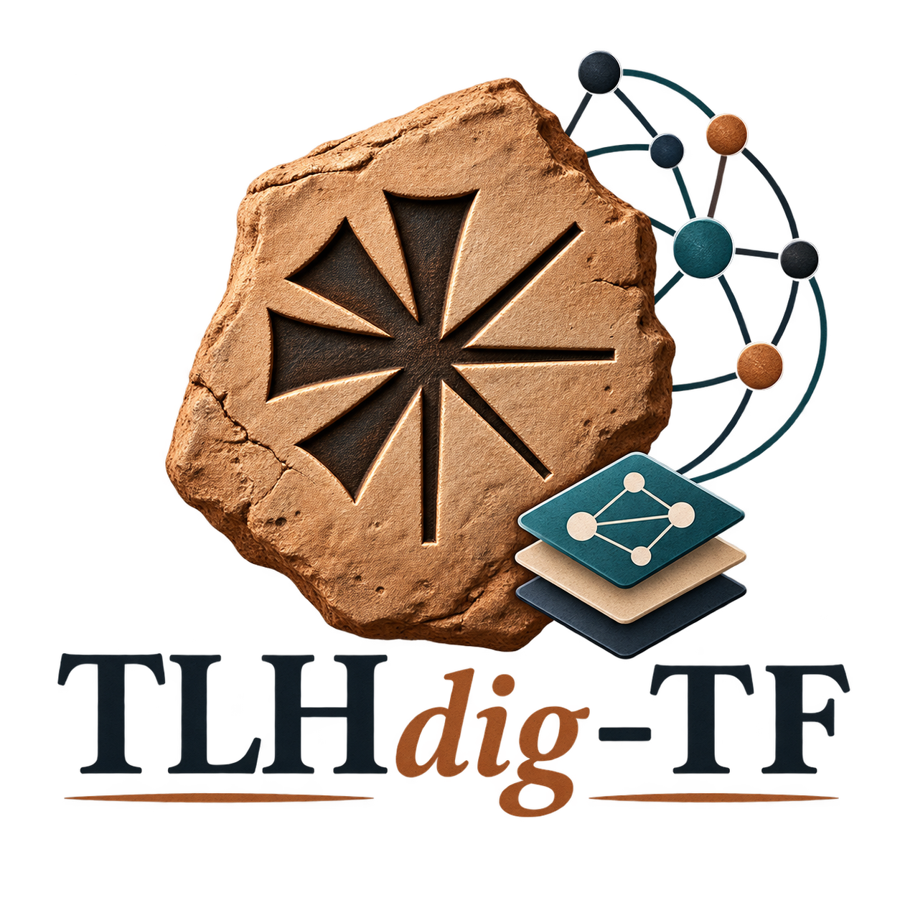

<p align="center">
  
</p>

# TLHdig-TF

Converting **TLHdig** — the *Thesaurus Linguarum Hethaeorum digitalis*, the largest
digital corpus of Hittite cuneiform transliterations — into
[Text-Fabric](https://github.com/annotation/text-fabric) format.

**Status: integration prototype — not a trustworthy conversion yet.** A dataset exists
in [`tf/0.1.0/`](tf/0.1.0) and loads in Text-Fabric with working section addressing,
text formats and morphology queries. The damage layer is now independently verified:
every `del`/`laes`/`ras`/`add`/`quot` marker in the source XML is accounted for in the
graph, checked by a gate that shares no code with the converter
([`reports/markers.md`](reports/markers.md)). Other guarantees below are still **not
yet true of the build** — `lex` is missing, `docid` is not unique as a section key, 52
files do not parse and 74 crossing-tag repairs await a Hittitologist. See
[KNOWN-ISSUES.md](KNOWN-ISSUES.md). Do not rely on `0.1.0` for research.

```python
from tf.fabric import Fabric

TF = Fabric(locations="tf/0.1.0")     # after cloning this repo
api = TF.loadAll()
api.T.nodeFromSection(("KUB 21.8", "Vs. II", "1\u2032"))
```

`use("alexsosn/TLHdig-TF")` does **not** work yet: that entry point needs an `app/`
directory, and this repo does not ship one. Clone and load with `Fabric` until it does.

### What loading this costs

Measured, not estimated. Check these against your machine before starting: an incomplete
load can fill a disk, and the numbers are not typical of a Text-Fabric corpus.

| | |
|---|---|
| dataset in git | **412 MB**, 108 files |
| Text-Fabric compiled cache (`tf/0.1.0/.tf/`) | **361 MB** |
| peak RSS during a full `loadAll()` | **~5 GB** |
| first load (compiling the cache) | **~12 minutes** |
| subsequent loads | **~40 seconds** |
| free disk you want before starting | **~1 GB** for the TF cache, and see the warning below |

Nearly half the cache is not your features. TF precomputes the embedding relations —
which node contains which — and at 8.2 M nodes over 3.4 M slots those dominate:

| | files | size |
|---|---:|---:|
| precomputed structures (`__levUp__`, `__levDown__`, `__boundary__`, …) | 8 | 192 MB |
| feature caches | 95 | 186 MB |

The cache is machine-local, TF-major-version-specific, and never committed.

> **Loading through Agora / Context-Fabric costs far more.** `cfabric` keeps its own
> cache in `.cfm/`, separate from TF's, and does not reuse it. One report on an earlier
> commit saw `.cfm` pass **3.5 GB and still growing after 23 minutes** before running out
> of disk — roughly ten times TF's cache for a *larger* build of the same corpus. That
> ratio has not been reproduced here and the cause is not established, so treat 3.5 GB as
> a floor, not a figure. If you are loading through Agora, have several GB free.

Load only the features you need if that is too much: `TF.load("otype oslots lemma …")`
instead of `loadAll()` cuts both time and memory sharply.

Node counts, damage-range statistics and the build invariants live in
**[`reports/census.md`](reports/census.md)**, regenerated from the shipped dataset by
`programs/census.py`. They are deliberately not repeated here: hand-copying them is what
left this file claiming 8,111,619 nodes against an actual 8,111,599, and
`KNOWN-ISSUES.md` calling `cluster` missing while 655,316 sat in `otype.tf`.

How Agora, Context-Fabric/`cfabric` and the TF app each load this repository — and what
each one needs that the others do not — is in
**[docs/AGORA-INTEGRATION.md](docs/AGORA-INTEGRATION.md)**.

Still to come: `docs/features.md`, a tagged release, and the remaining items in
[KNOWN-ISSUES.md](KNOWN-ISSUES.md).

---

## Why

TLHdig ships ~24,000 XML documents in HPM's "AOxml" format: transliterations of
essentially every published cuneiform fragment from Hittite tablet collections, richly
annotated with morphology, editorial apparatus and line-level Unicode cuneiform. It is
searchable through the HPM web interface, but the XML is awkward to compute over —
counting, aggregating, colocation and other corpus-linguistic work all mean writing a
parser first.

Text-Fabric is built for exactly that. It models text as a sequence of slots with
arbitrary annotated nodes over them, which fits cuneiform well: damage brackets that
cut through the middle of a sign and run across word and line boundaries are ordinary
nodes, not a schema violation.

There is currently **no Hittite corpus in Text-Fabric**. The four existing cuneiform
datasets under [Nino-cunei](https://github.com/Nino-cunei) are Akkadian and
proto-cuneiform; this conversion adapts their conventions rather than copying them
(see [the plan](docs/TF-CONVERSION-PLAN.md) §1).

In one sentence: TLHdig already answers *"what does this tablet say?"* well. Text-Fabric
would answer *"what does the corpus do?"* — and specifically, it would let you ask that
while knowing how much of your evidence is broken or undetermined, which is currently
the hardest thing to find out.

## The corpus

| | |
|---|---|
| XML files | 23,937 (23,713 parse cleanly, 224 malformed) |
| Words | 1,221,053 |
| Signs (projected slots) | ≈3,097,100 |
| Lines | 407,623 |
| Documents | 23,713 across 829 CTH classes and 13 sub-corpora |
| Morphological analyses | 1,611,153 |
| Distinct lemmata | 28,091 |
| Lines with Unicode cuneiform | 405,787 |

## What this makes possible

All figures below are measured against the corpus in this repository; the underlying
measurements are in [the research document](docs/TF-CONVERSION-RESEARCH.md) §10.

> **Section 1 works and its invariants are checked** ([`reports/census.md`](reports/census.md),
> regenerated from the shipped dataset by `programs/census.py`). Section 5 is still
> absent — no `note`, `fragment`, `lex` or `docgroup` nodes. See
> [KNOWN-ISSUES.md](KNOWN-ISSUES.md).

### 1. Damage-aware querying

**About 39.6% of words touch a damaged range**, on the current model — a *candidate
statistic*, not a verified property of the corpus. It is computed with point breaks
excluded and under the line-end convention below. Treat it as provisional until the
independent source-marker gate (`programs/check_markers.py`) has run against a build.

Read that figure with its assumption attached. An unclosed `del_in` has no closing
marker, so its extent is a **convention, not a fact in the source**: it is taken to run
to the end of its line, which is what the measured lookahead supports (only 40% of
line-final opens are continued on the next line). A different convention yields a
different percentage.

*This is the third figure published here. The first (53.4%) came from a naive pairing
the research document itself flags as unreliable; the second (28.7%) from a build whose
cluster extents were later found to be wrong. Those were broken machinery. This one
rests on a stated convention — a different kind of uncertainty, not a smaller version of
the same one. Note also that the build's own `flags == cluster coverage` check cannot
corroborate it: the flags are derived from that coverage, so the check is a tautology.
That is what `check_markers.py` exists to remedy.*

So "give me the attestations of this lemma that are **not** restored" today means
reimplementing bracket-state tracking over the whole corpus. Few people do, which is why
published counts of Hittite forms rarely separate *read* from *restored*. Afterwards:

```
word
  analysis lemma=pai-/pā-
/without/
  cluster type=del width>1
/-/
```

Two things about that query are easy to get wrong, and both were wrong here:

* `lemma`, `pos` and `morph` live on **`analysis`** nodes, not on `word` — a word may
  carry up to 99 competing analyses, so they cannot be word features.
* **`width>1` is required.** A zero-width range (a `<del_in/><del_fin/>` point break)
  is anchored to a neighbouring sign so Text-Fabric will not delete it as unlinked, so
  it *structurally covers* that sign even though it damages nothing. Without the filter
  a word is reported damaged because a point break sits next to it.

Measured on three common verbs:

The corpus carries a large damage layer:

(exact counts per family in [`reports/census.md`](reports/census.md))

**Roughly 41% of lacuna markers enclose no sign at all** — `<del_in/><del_fin/>` pairs meaning
"a break of unknown extent is here". They are kept as points, anchored to a boundary
sign but flagging nothing. An earlier build discarded them, losing 207,000 editorial
statements while every other check still passed. The contrast with `laes` (49 points of
144,257) suggests this is specific to how lacunae are encoded rather than a general
artefact, and is worth a Hittitologist's eye.

### 2. The ambiguity layer becomes first-class

| | Words |
|---|---|
| selector resolves to one analysis | 429,176 |
| **>1 candidate, no selector — genuinely undetermined** | **215,613** |
| 2–9 candidates | 296,593 |
| ≥10 candidates | 11,525 |

Today those competing readings are `mrp1`…`mrp99` attribute strings: present, but not
queryable. As `analysis` nodes they support questions that currently have no mechanism —
*how often is this form ambiguous between D/L.SG and ALL?* *Which lemmata are
systematically confusable?* *What share of my evidence rests on undisambiguated
readings?* The last is a methodological check no one can presently run.

### 3. Aggregation across documents

The XML is per-file, so every cross-corpus question needs a bespoke parser. `wed=a-`
"build" occurs 868 times, distributed TLH 432 / HDivT 123 / HAnn 116 / MYTH 76 /
KULTINV 51. Frequency lists, collocations, distribution by CTH class or sub-corpus,
hapax identification — one-liners rather than projects.

### 4. Relational search

TF templates express containment and order, which XML cannot without a graph:

```
colon
  w1:word
    analysis lemma=nu=
  w2:word
    analysis pos=PREV
  w3:word
    analysis morph~3SG.PRS
  w1 < w2
  w2 < w3
```

Multi-layer queries — morphology × damage × language × structural position — are the
normal case in linguistics and are currently impractical.

### 5. Layers that are effectively dark today

* **Witnesses and joins** — which fragments compose a text, joined directly or indirectly.
* **Editorial history** — ~180,000 dated, attributed `<meta>` events, making it possible
  to query the corpus by its own reliability (*which parts have had a second correction
  pass?*).
* **Duplicate editions** — the 114 differing re-editions of one tablet become
  systematically comparable rather than accidental.

### 6. Interoperability

The same query language as [BHSA](https://github.com/ETCBC/bhsa) and the Nino-cunei
corpora, so Akkadian passages *inside* Hittite texts become comparable with Old
Babylonian Akkadian. TF's pandas and MQL exports make the corpus usable as ML input
without anyone writing an AOxml parser first.

### What this does **not** give you

* It does not improve the data. Uneven annotation stays uneven; 473,967 words carry no
  analysis at all and will not gain one.
* It does not disambiguate morphology — it makes ambiguity visible and countable, which
  is a different thing from resolving it.
* It does not replace TLHdig for reading a text, browsing by CTH, or the photographic
  and manuscript apparatus. TF is for asking questions across a corpus, not for
  consulting a tablet.
* Cuneiform stays line-level; there is no sign-aligned Unicode unless upstream has an
  alignment.
* It is not a critical edition, and the plan explicitly forbids the converter from
  drifting into becoming one.

## Repository layout

```
corpus/TLHdig-0.3/     source data, unmodified — CC-BY-4.0, see ATTRIBUTION.md
docs/                  research findings and the conversion plan
```

```
tf/0.1.0/              the generated Text-Fabric dataset (counts in reports/census.md)
app/                   Text-Fabric app: what use() and the TF browser read
programs/tlhdig/       converter: source, signs, morph, brackets, lineref,
                       repair, convert, compact
programs/patches.yaml  repair manifest (173 files, 632 patches)
programs/tests/        pytest suite
programs/check_*.py    full-corpus gates
programs/build.py      the full conversion
programs/census.py     regenerates reports/census.md from the shipped dataset
programs/check_markers.py  independent source-marker conservation gate
programs/corpus.sha256 pinned identity of the source corpus
programs/excluded.txt  the 53 files that cannot be converted, with reasons
```

Planned, per [the plan](docs/TF-CONVERSION-PLAN.md) §9: `app/` (TF browser config),
`docs/features.md`, and `reports/` validation output.

**Two version numbers, deliberately unrelated.** `sourceVersion = 0.3` identifies the
upstream TLHdig release; `tfVersion = 0.1.0` identifies this ontology and converter, and
is what `tf/` is named after. Keeping them separate means a fix to the converter or a
change to the node model can ship without implying that TLHdig itself released
anything.

## Documents

* **[docs/TF-CONVERSION-RESEARCH.md](docs/TF-CONVERSION-RESEARCH.md)** — what the corpus
  contains and how AOxml encodes it. Every count is measured against the files on disk;
  where upstream HPM/HFR/SimTex documentation exists it is cited and reconciled with the
  measurements. Includes the full `mrp` morphology grammar, the `lnr` line-reference
  grammar, a complete markup inventory, and a classification of all 224 malformed files.

* **[docs/TF-CONVERSION-PLAN.md](docs/TF-CONVERSION-PLAN.md)** — the target Text-Fabric
  model (node types, feature catalogue, edges, `otext` config), a nine-stage conversion
  pipeline, the validation strategy, and the five questions still open with the TLHdig
  team.

## Design in one paragraph

The slot type is **`sign`**, not `word` — settled by measurement, and independently
confirmed by all four existing cuneiform TF corpora. Editorial damage brackets fall
*inside* a sign in the majority of cases (`laes_fin` 89% of the time, `del_fin` 55%) and
run across word and line boundaries, so word-level slots cannot represent damage extents.

Above `sign` sit `word`, `line`, `column`, `surface`, `paragraph`, `colon` and
`document`, with `analysis`, `cluster`, `note`, `edit`, `fragment`, `lex` and `docgroup`
as analytical and relational overlays. Following Uruk, the full ontology is declared in
`@levels` while only three levels — `document / column / line` — serve as navigational
sections, addressed the way a Hittitologist cites: `KUB 21.8`, `€1 Vs. II`, `5′`.

The plan carries **two explicit guarantees** rather than one vague one: the original
bytes stay recoverable via byte-range features into the source files, and the TF graph
is content-complete, with every AOxml construct resolving to a node, edge or feature
rather than surviving as an opaque string.

At ~3.1M signs and ~7.2M nodes this would be roughly **4× the largest existing cuneiform
TF dataset** (Old Assyrian, 766k signs), so the first milestone is a scale benchmark, not
code.

## Licensing

Two licences apply, and they do not overlap:

| Path | Licence | Applies to |
|---|---|---|
| `corpus/**` | **CC-BY-4.0** — [licence text](corpus/TLHdig-0.3/LICENSE), [attribution](corpus/TLHdig-0.3/ATTRIBUTION.md) | the source data |
| `tf/**` | **CC-BY-4.0** | the generated dataset — an *adaptation* of the corpus, so it inherits the corpus licence |
| everything else | **MIT** — [licence text](LICENSE) | the code and documentation |

`SPDX-License-Identifier: MIT` for the code; `SPDX-License-Identifier: CC-BY-4.0` for
everything under `corpus/` **and `tf/`**. A conversion is a derivative work: it cannot be
relicensed as MIT, and each `.tf` file carries `@license=CC-BY-4.0` with the required
attribution so the dataset stays self-describing when detached from this repository. GitHub's repository-level licence badge reads the root
`LICENSE` only and will therefore show MIT — that badge does **not** describe the
corpus.

If you use the corpus, cite the dataset, not this repository:

> Müller, G.; Prechel, D.; Rieken, E.; Schwemer, D. *Thesaurus Linguarum Hethaeorum
> digitalis (TLHdig) Beta Version 0.3.* Zenodo, 2026.
> <https://doi.org/10.5281/zenodo.20328284>

## Acknowledgements

The corpus is the work of the TLHdig team at the Hethitologie-Portal Mainz and of the
Hittitological community whose transliterations it aggregates. The conversion design
follows [Nino-cunei/tfFromAtf](https://github.com/Nino-cunei/tfFromAtf) for cuneiform
modelling and [ETCBC/bhsa](https://github.com/ETCBC/bhsa) for Text-Fabric conventions.
