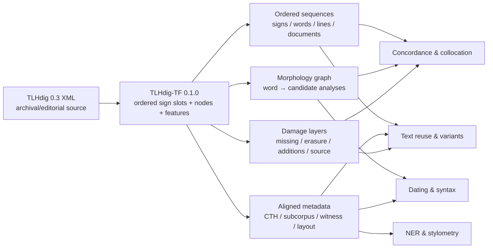

# TLHdig-TF as a Research Corpus: Hittitological Analyses That Become Practical Once the XML Is Tokenized

## Executive summary

The strongest case for [TLHdig-TF](https://github.com/alexsosn/TLHdig-TF) is not that Text-Fabric replaces the TLHdig XML. The XML remains the richer archival/editorial source representation. TLHdig-TF turns that representation into an **ordered, addressable annotation graph** in which tokens, signs, morphological alternatives, document metadata, damage, layout, and editorial information can be retrieved without repeatedly reconstructing text order and annotation scope from XML trees. This is exactly the kind of transformation that Yavasan and Gordin identify as necessary for machine-learning work with Hittite corpora: their independent XML-to-computational-data pipeline was motivated by fragmentary texts, multiple language layers, and complex philological annotation, and they showed that the resulting structured data can support downstream NLP experiments. citeturn5search12turn7search3

The present TLHdig-TF `0.1.0` build is substantial. I inspected the actual `otype.tf`, rather than relying only on the conversion plan: it contains **23,884 document nodes, 1,239,541 word nodes, 1,631,419 analysis nodes, 398,168 line nodes, 77,045 edit nodes, and 3,404,797 sign slots**, for 7,456,283 nodes in total. fileciteturn8file0L2-L2 Its source is TLHdig Beta 0.3, which Zenodo describes as a complete dataset of the relevant published texts available as of May 2026. citeturn10search6 The normal access pattern is simply:

```python
from tf.app import use
A = use("alexsosn/TLHdig-TF")
F, E, L, T = A.api.F, A.api.E, A.api.L, A.api.T
```

That use pattern is documented in the repository and corresponds to Text-Fabric's standard API, where `F` retrieves node features, `E` graph edges, `L` containment/locality, and `T` configured text representations. fileciteturn2file0L2-L2 citeturn8search0turn8search1turn8search9

For real Hittitological research, I would prioritize eight notebook projects:

| Priority | Notebook | Hittitological payoff |
|---|---|---|
| Very high | Damage-aware concordances and collocation | Separates secure attestations from restoration-dependent distributions |
| Very high | Morphological ambiguity and contextual disambiguation | Turns existing alternative analyses into a trainable ranking problem |
| Very high | Parallel-passage and text-reuse discovery | Scales a standard philological method for restoring and reconstructing compositions |
| Very high | Variant-reading and duplicate-edition alignment | Makes orthographic/editorial divergence measurable |
| Very high | Dating and dialectological feature testing | Quantitatively tests traditional orthographic and linguistic dating criteria |
| High | Clitic placement and constructional syntax | Makes corpus-wide tests of Hittite syntax/prosody practical |
| High | Named entities and prosopographic networks | Bridges TLHdig contexts with LAMAN and prosopographic datasets |
| High, with caveat | Stylometry and scribal/orthographic fingerprinting | Useful for copy groups and scribal traditions, but not a replacement for image-based palaeography |

These are preferable, in my assessment, to making generic topic modeling the flagship demonstration. Topic models are trivial to run once documents are vectorized, but Hittite corpora contain strong genre, formulaicity, CTH, language-layer, and textual-tradition effects; the eight tasks above connect much more directly to questions already debated in Hittitological literature. Corpus research on Hittite relative constructions, clitics, dating, scribal practice, parallel passages, and prosopography supplies concrete benchmarks against which computational results can be judged. citeturn4search1turn6search1turn6search4turn11search0turn3search1turn12search10

## What the corpus actually exposes

A crucial distinction is between the **current build** and the more ambitious ontology described in `docs/TF-CONVERSION-PLAN.md`. The current `otype.tf` contains `sign`, `analysis`, `colon`, `column`, `document`, `edit`, `layout`, `line`, `paragraph`, `surface`, and `word` nodes. It does **not** currently contain the planned `cluster`, `fragment`, `lex`, `docgroup`, or `note` node types. fileciteturn8file0L2-L2 The conversion plan should therefore be read as design documentation, not as an inventory of guaranteed `0.1.0` objects. fileciteturn5file0L2-L2

The feature files do, however, expose an unusually useful combination of layers. At word level there are features such as `trans`, `mrpsel`, `mrpsel_kind`, `sel_base`, `sel_clitic`, `sel_group`, and `nanalyses`; analysis nodes carry `lemma`, `gloss`, `morph`, `pos`, `stemclass`, `field4_kind`, and separate clitic features; sign slots carry `sym`, source XML, damage/editorial indicators such as `missing`, `laes`, `ras`, `add`, `corr`, determinative/numeral information, language, and source-span information. Document and structure features include `docid`, `cth`, `subcorpus`, `lnr`, `lnno`, `cu`, and related cuneiform fields. fileciteturn3file0L2-L2 Morphological alternatives are modeled as analysis nodes, with planned word-to-analysis `analyses` and selection relationships rather than packing a variable number of analyses into a single XML string. fileciteturn6file0L2-L2

The structural text configuration is likewise worth checking rather than assuming. `otext.tf` defines sections as **document → column → line** and defines source/original and plain sign-oriented text representations plus line-level cuneiform. There is no explicit `sentence` node in the current build. fileciteturn11file0L2-L2 For syntactic notebooks, therefore, `colon` can be investigated as a segmentation aid, but clause/sentence boundaries should be validated independently instead of being silently equated with `colon`. This is one place where a future sentence layer would materially improve the resource.

Damage is a particularly strong design feature. The conversion plan explains that deletion/lacuna markup can cross word and even line boundaries, which is one reason the conversion anchors annotations to a linear sequence of sign slots instead of treating an XML element as the fundamental textual unit. fileciteturn5file0L2-L2 The repository README's source census reports that 651,668 of 1,221,053 words—53.4%—were in or against a lacuna under its damage criterion, and notes that only 71.9% of relevant closing damage markers resolved inside their own line. fileciteturn2file0L2-L2 That scale makes damage status a statistical variable rather than a marginal editorial nuisance.

The `frag` feature in the actual build is a column-level “fragment/witness siglum in scope for this column,” which is useful even though there is no `fragment` node type. fileciteturn10file0L2-L2 This should prove useful for witness-sensitive analysis and candidate-join work.

Text-Fabric is well suited to this structure because its basic model is explicitly an annotated graph anchored by natural-number nodes, with markup removed from the running representation while logical structure remains accessible through features and edges. Its API is designed for corpora converted from XML, OCR, databases, or plain text, and it supports both programmatic feature access and graph-pattern queries. citeturn8search0turn8search2



For all notebooks below, a useful common prelude is:

```python
# pip install text-fabric pandas numpy scipy scikit-learn nltk
# Optional by notebook:
# pip install datasketch rapidfuzz edlib networkx gensim transformers

from tf.app import use
from collections import Counter, defaultdict
import pandas as pd
import numpy as np

A = use("alexsosn/TLHdig-TF")
F, E, L, T = A.api.F, A.api.E, A.api.L, A.api.T

documents = F.otype.s("document")
words = F.otype.s("word")
analyses = F.otype.s("analysis")

def one_up(node, kind):
    x = L.u(node, otype=kind)
    return x[0] if x else None

def selected_analysis(w):
    """Use when the selected edge is populated for this word."""
    xs = E.selected.f(w)
    return xs[0] if xs else None
```

The repository path has no additional constraint in the request: notebooks can normally let `use()` download the corpus, while direct feature inspection can assume `tf/0.1.0/*.tf`. Text-Fabric documents automatic corpus download through `use("org/repo")`. citeturn8search1

## Detailed notebook outlines

### Damage-aware concordances: how much of a linguistic pattern survives when restorations are removed?

**Research question.** Take a lemma, construction, or collocation routinely cited in grammatical or lexicographic discussion—say a verbal lemma, a particle sequence, or a ritual formula—and ask: *does its distribution remain the same when only securely preserved occurrences are counted?* A second version asks whether particular genres or CTH groups rely disproportionately on restored examples. This is directly relevant to a closed, fragmentary historical corpus because quantitative generalizations can otherwise give a reconstructed word exactly the same evidential weight as a fully preserved word. Yavasan and Gordin explicitly identify fragmentation and preservation of philological annotation as central problems in making Hittite corpora computationally usable. citeturn5search12

This connects naturally to corpus-based Hittite syntax. Lyutikova and Sideltsev's study of Hittite relative constructions, for example, draws conclusions from a much broader corpus than earlier treatments and systematically analyzes the distribution of relative wh-phrases. A damage-sensitive replication could establish which distributional claims are robust under stricter preservation criteria. **Literature:** Ekaterina Lyutikova and Andrei Sideltsev, “Relative construction in Hittite: A corpus-based case study in syntax-prosody interface,” *Journal of Historical Linguistics* 13.3 (2023), 375–460, [DOI 10.1075/jhl.22014.lyu](https://doi.org/10.1075/jhl.22014.lyu). citeturn4search1

**Why TF simplifies it.** In source XML, a clean/damaged distinction may require interpreting nested and crossing editorial markers while maintaining the current word and line context. The TF conversion already gives each word an ordered set of sign slots and carries source/damage features on those slots. The repository's own statistics show that damage markup frequently cannot be treated as a purely line-local phenomenon. fileciteturn5file0L2-L2 fileciteturn2file0L2-L2 Once converted, “is this word touched by missing signs?” is an ordinary Boolean feature derived from `L.d(word, otype="sign")`; the same word simultaneously retains its document, CTH, subcorpus, transliteration, and selected morphological analysis. That turns a stateful XML traversal into a dataframe column.

**Notebook recipe.** Required inputs are only TLHdig-TF. Start conservatively by defining “damaged” from `missing`; add `laes`, `ras`, additions, corrections, or other editorial phenomena as separate sensitivity variables rather than silently collapsing all uncertainty into one class.

```python
def has_feature_on_signs(w, feature):
    return any(bool(feature.v(s)) for s in L.d(w, otype="sign"))

rows = []
for w in words:
    a = selected_analysis(w)
    d = one_up(w, "document")
    rows.append({
        "word": w,
        "form": F.trans.v(w),
        "lemma": F.lemma.v(a) if a else None,
        "morph": F.morph.v(a) if a else None,
        "docid": F.docid.v(d) if d else None,
        "cth": F.cth.v(d) if d else None,
        "subcorpus": F.subcorpus.v(d) if d else None,
        "missing": has_feature_on_signs(w, F.missing),
        "erased": has_feature_on_signs(w, F.ras),
        "laes": has_feature_on_signs(w, F.laes),
    })

df = pd.DataFrame(rows)
```

A first result is a **damage-sensitivity table**:

```python
target = "wed=a-"       # inspect actual lemma inventory first
x = df[df["lemma"] == target]

print(x.groupby(["subcorpus", "missing"]).size().unstack(fill_value=0))
```

The README reports, as an illustrative source-census example, 868 occurrences of `wed=a-`, distributed across several subcorpora, with a substantial but minority damaged component. That makes it a useful regression test while remembering that the present build's node census is newer than the README's source census. fileciteturn2file0L2-L2

For collocation, construct sequences document by document and preserve word IDs:

```python
from nltk.collocations import BigramCollocationFinder
from nltk.metrics import BigramAssocMeasures

lemmas = []
for d in documents:
    for w in L.d(d, otype="word"):
        if has_feature_on_signs(w, F.missing):
            continue
        a = selected_analysis(w)
        lemma = F.lemma.v(a) if a else None
        if lemma:
            lemmas.append(lemma)

finder = BigramCollocationFinder.from_words(lemmas, window_size=5)
finder.apply_freq_filter(5)
top = finder.score_ngrams(BigramAssocMeasures.likelihood_ratio)[:50]
```

Better still, do not concatenate documents across boundaries: calculate within-document windows and aggregate them. Expected outputs are KWIC tables with `[docid, CTH, line, form, lemma, damage]`, clean-vs-all frequency ratios, log-likelihood/PMI collocations, and a plot showing effect size when progressively stricter damage filters are applied.

**Validation and pitfalls.** Manually annotate a stratified sample of perhaps 200–500 words as “secure / partly damaged / restored / uncertain” and calculate precision and recall for the automatic `missing`-based filter. Report every major result both with and without damage filtering. Bootstrap documents, rather than individual word tokens, for confidence intervals so that a repetitive tablet does not create false precision. PMI should never be trusted for low-frequency pairs without a frequency threshold. Restoration is also philological evidence rather than “bad data”: the objective is sensitivity analysis, not deletion.

**Complexity.** One pass through roughly 1.24 million word nodes and their sign descendants is a laptop task—typically seconds to a few minutes after TF has loaded, depending on caching. No HPC is required. Large bootstrap experiments remain comfortable on 16 GB RAM if the extracted dataframe is cached as Parquet.

**README mini-example.**

```python
w = F.otype.s("word")[1000]
print(F.trans.v(w),
      any(F.missing.v(s) for s in L.d(w, otype="sign")))
# One token, immediately paired with its preservation status.
```

### Morphological ambiguity atlas and contextual disambiguator

**Research question.** Which Hittite forms are genuinely hard to analyze, which morphological categories account for most ambiguity, and can the surrounding context rank TLHdig's existing analyses better than frequency alone? This is more philologically useful than asking a black-box model to invent morphology from scratch: the corpus already contains candidate analyses, so the practical task can be framed as **candidate disambiguation**.

There is a direct computational precedent. Sukhareva et al. developed the first statistical POS-tagging experiment for Hittite under extreme data sparsity, projecting annotation from German translations and obtaining 69% POS accuracy; their paper emphasizes the absence, at that time, of conventional annotated training data and the need to mitigate sparse Hittite forms. **Literature:** Maria Sukhareva, Francesco Fuscagni, Johannes Daxenberger, Susanne Görke, Doris Prechel, and Iryna Gurevych, “Distantly Supervised POS Tagging of Low-Resource Languages under Extreme Data Sparsity: The Case of Hittite,” in *Proceedings of LaTeCH 2017*, 95–104, [DOI 10.18653/v1/W17-2213](https://doi.org/10.18653/v1/W17-2213). citeturn7search1 Yavasan and Gordin's 2025 experiments subsequently demonstrated a larger machine-readable Hittite dataset and reported much better results for translation than for morphological glossing, reinforcing that morphology remains an open computational problem. **Literature:** Emma Yavasan and Shai Gordin, “From Clay to Code: Transforming Hittite Texts for Machine Learning,” *Proceedings of the Second Workshop on Ancient Language Processing* (2025), 77–86, [DOI 10.18653/v1/2025.alp-1.10](https://doi.org/10.18653/v1/2025.alp-1.10). citeturn7search3

**Why TF simplifies it.** The current build has over 1.63 million **analysis nodes** in addition to its word nodes. fileciteturn8file0L2-L2 The conversion design represents morphology as separate nodes with fields including lemma, gloss, morph, stem class, POS, clitic information, parsing status, and raw analysis, with words linked to their alternatives and—in cases where the source provides a selection—to a selected analysis. fileciteturn6file0L2-L2 The word-level `nanalyses`, `mrpsel`, and related selector features provide immediate diagnostics. In XML, a machine-learning table requires custom parsing and normalization of each morphology structure; here it is graph traversal.

Start with an **ambiguity atlas** before training anything:

```python
amb = []
for w in words:
    candidates = list(E.analyses.f(w))
    if len(candidates) <= 1:
        continue

    amb.append({
        "w": w,
        "form": F.trans.v(w),
        "n": len(candidates),
        "candidate_lemmas": tuple(F.lemma.v(a) for a in candidates),
        "candidate_morphs": tuple(F.morph.v(a) for a in candidates),
        "selector_kind": F.mrpsel_kind.v(w),
    })

amb_df = pd.DataFrame(amb)
amb_df.sort_values("n", ascending=False).head(30)
```

That notebook alone can answer useful lexicographic questions: which surface spellings have the highest analysis entropy, which lemma pairs are repeatedly confused, and whether ambiguity is disproportionately concentrated in damaged words or certain CTH groups.

A first contextual ranker can use selected cases as supervised examples. Build one row per candidate:

```python
records = []

for d in documents:
    ws = list(L.d(d, otype="word"))
    for i, w in enumerate(ws):
        candidates = list(E.analyses.f(w))
        selected = set(E.selected.f(w))
        if not candidates or not selected:
            continue

        prev_form = F.trans.v(ws[i - 1]) if i else "<BOS>"
        next_form = F.trans.v(ws[i + 1]) if i + 1 < len(ws) else "<EOS>"

        for a in candidates:
            records.append({
                "doc": d,
                "form": F.trans.v(w) or "",
                "prev": prev_form or "",
                "next": next_form or "",
                "lemma": F.lemma.v(a) or "",
                "morph": F.morph.v(a) or "",
                "pos": F.pos.v(a) or "",
                "y": int(a in selected),
            })
```

For a notebook baseline, concatenate candidate and context strings and use character n-grams plus logistic regression:

```python
from sklearn.feature_extraction.text import TfidfVectorizer
from sklearn.linear_model import LogisticRegression
from sklearn.pipeline import make_pipeline

train_text = (
    train.form + " || " + train.prev + " " + train.next +
    " || " + train.lemma + " " + train.morph + " " + train.pos
)

model = make_pipeline(
    TfidfVectorizer(analyzer="char", ngram_range=(2, 5), min_df=2),
    LogisticRegression(max_iter=1000, class_weight="balanced")
)
model.fit(train_text, train.y)
```

A stronger version treats each word's candidates as a ranking set; a ByT5/character-transformer model is reasonable after the transparent baseline is established. Hugging Face is useful here because Hittite spelling and morphology make character/subword modeling preferable to an English-centric word vocabulary.

**Validation and pitfalls.** Split by **document, preferably CTH/composition**, not randomly by candidate rows; otherwise identical formulae and forms leak into train and test. Report top-1 accuracy, top-2 accuracy, macro-F1 by morphology/POS, mean reciprocal rank, and calibration. Create a hand-corrected gold set of difficult ambiguous forms and report performance separately on it. A source selector is best treated initially as **silver** supervision: it reflects editorial analysis, and unselected alternatives are not necessarily “wrong” in the abstract.

A particularly useful error analysis is a confusion graph: nodes are lemmas or morphological tags and weighted edges count how often two candidates compete for the same token. This turns the model's failures into a guide for annotation and lexicographic cleanup.

**Complexity.** The ambiguity inventory and sparse logistic baseline are ordinary laptop work, roughly minutes. Character transformers benefit strongly from a GPU but do not require an HPC cluster; a few hours on a single modern GPU is a more realistic upper tier. Exhaustive hyperparameter searches are low priority for philological research.

**README mini-example.**

```python
Counter(F.nanalyses.v(w) for w in words).most_common(10)
# Instant answer: how many analyses does a typical TLHdig-TF word carry?
```

### Parallel-passage discovery and restoration by corpus-wide text reuse

**Research question.** Given a fragmentary ritual, myth, instruction, prayer, catalogue, or festival passage, where else in the corpus does an identical or approximately parallel sequence occur? Can the system find a parallel that supplies words missing in the broken witness, or identify a family of formulae whose substitutions illuminate the composition's textual history?

This is a standard Hittitological method with exceptionally clear published examples. Pisaniello restored parts of KUB 35.146 by recognizing parallels with passages in other Hittite-Luwian ritual texts and used those parallels to discuss how ritual compositions were put together. **Literature:** Valerio Pisaniello, “Parallel passages among Hittite-Luwian rituals: for the restoration of KUB 35.146,” *Vicino Oriente* 19 (2015), 25–37, [DOI 10.53131/VO2724-587X2015_2](https://doi.org/10.53131/VO2724-587X2015_2). citeturn11search0turn11search2 Pisaniello has also used internal parallels to propose restorations in the Tunnawiya ritual, illustrating that this is an ordinary philological operation rather than an NLP contrivance. citeturn11search10

There is also a striking computational Hittite precedent: Stephen Tyndall proposed automatic methods for assembling Hittite-language cuneiform fragments into larger texts. **Literature:** Stephen Tyndall, “Toward Automatically Assembling Hittite-Language Cuneiform Tablet Fragments into Larger Texts,” *Proceedings of ACL 2012*, 243–247, [ACL Anthology P12-2048](https://aclanthology.org/P12-2048/). citeturn10search8 More generally, John Lee demonstrated a computational model of text reuse designed for noisy ancient literary texts. **Literature:** John Lee, “A Computational Model of Text Reuse in Ancient Literary Texts,” *Proceedings of ACL 2007*, 472–479, [ACL Anthology P07-1060](https://aclanthology.org/P07-1060/). citeturn5search13

**Why TF simplifies it.** Text reuse needs thousands of **ordered sequences**. With TF, every document can be flattened in canonical order with:

```python
ws = L.d(document, otype="word")
```

and every word can immediately be represented at several levels: source transliteration (`trans`/source features), selected lemma, candidate lemmas, or sign sequence. Metadata such as `cth` and `subcorpus` is attached to the same document node, and damaged tokens can be masked without destroying token coordinates. fileciteturn3file0L2-L2 In XML the same experiment begins with a bespoke serializer, metadata joins, damage-state handling, and token-boundary decisions; Yavasan and Gordin's work documents why that conversion itself is a substantial stage of Hittite NLP. citeturn5search12

Use two representations in parallel:

1. **surface/sign sequence** for close copying and orthographic correspondences;
2. **lemma sequence** for parallels obscured by inflection or spelling differences.

```python
def lemma_or_form(w):
    a = selected_analysis(w)
    lemma = F.lemma.v(a) if a else None
    return lemma or F.trans.v(w) or ""

doc_tokens = {}
for d in documents:
    doc_tokens[d] = [
        lemma_or_form(w)
        for w in L.d(d, otype="word")
        if not has_feature_on_signs(w, F.missing)
    ]
```

For a laptop-scale corpus search, do **candidate retrieval before alignment**. Hash 5–8-token shingles and use MinHash/LSH:

```python
from datasketch import MinHash, MinHashLSH

def fingerprint(tokens, n=5, num_perm=128):
    m = MinHash(num_perm=num_perm)
    for i in range(len(tokens) - n + 1):
        shingle = "\x1f".join(tokens[i:i+n])
        m.update(shingle.encode("utf8"))
    return m

lsh = MinHashLSH(threshold=0.25, num_perm=128)
fps = {}

for d, toks in doc_tokens.items():
    if len(toks) < 10:
        continue
    m = fingerprint(toks)
    fps[d] = m
    lsh.insert(str(d), m)
```

Then rerank candidate pairs with token-level alignment. `difflib.SequenceMatcher` makes a readable demonstration:

```python
from difflib import SequenceMatcher

a = doc_tokens[d1]
b = doc_tokens[d2]

sm = SequenceMatcher(None, a, b, autojunk=False)
for block in sm.get_matching_blocks():
    if block.size >= 5:
        print(block, a[block.a:block.a + block.size])
```

For research use, replace exact blocks with Smith–Waterman or a weighted local aligner in which same lemma > same normalized form > similar edit-distance form > mismatch. Recent work on ancient-text alignment likewise combines linguistic representations with Smith–Waterman-style alignment because orthographic variation makes literal string identity insufficient. citeturn5search6turn5search11

The output should be an interactive table:

`query passage | matching passage | document IDs | CTHs | aligned tokens | score | damaged tokens | shared n-grams`

with an alignment visualization showing matches, substitutions, gaps, and reconstructions. A network graph with passages as nodes and reuse scores as edges can then reveal textual families.

**Validation and pitfalls.** Start with published known positives, especially Pisaniello's KUB 35.146 parallels. Ask whether they occur in the top 1, 5, 10, and 100 retrieved results. Report precision@k, recall@k, mean average precision, and alignment F1 on manually marked parallel spans. Evaluate formulaic ritual passages separately: frequent formulae are real parallels but may not imply direct copying. IDF-weighting common lemmas and particles can reduce useless high-frequency matches.

Never automatically insert the best parallel into a lacuna and label it “restored.” Output **restoration candidates with provenance**. The philologist remains responsible for space, grammar, tablet layout, textual tradition, and whether the parallel is sufficiently close.

**Complexity.** Naively comparing every document pair is \(O(D^2)\) and unnecessary. MinHash/LSH over about 24,000 documents is a comfortable laptop job, normally minutes to tens of minutes. Aligning only retrieved candidates is similarly cheap. Exhaustive all-pairs dynamic programming could justify HPC; there is little research reason to begin there.

**README mini-example.**

```python
d = documents[0]
print([lemma_or_form(w) for w in L.d(d, otype="word")][:20])
# Any tablet is immediately an NLP-ready ordered token sequence.
```

### Variant readings, re-editions, and scribal divergence as sequence alignment

**Research question.** When TLHdig contains multiple editions or textual witnesses associated with the same tablet/text identity, exactly where do they differ? Are the differences punctuation/editorial markup, sign reading, spelling, morphology, omissions, additions, or genuinely different phrasings? Across parallel witnesses, which lexical categories—notably proper names—show unusually high orthographic instability?

This has a direct Hittitological analogue in Dennis Campbell's study of parallel Hittite tablet catalogues. Campbell compared two lists containing substantially the same sequence of texts but numerous orthographic and phrasal differences, arguing that their pattern is compatible with independent production through dictation; he also found that proper nouns displayed especially variable orthography. **Literature:** Dennis R. M. Campbell, “Between the Written and Spoken: Dictation, Scribal Practice and Tablet Catalogues,” *Ancient Near Eastern Studies* 52 (2015), 69–105, [DOI 10.2143/ANES.52.0.3082866](https://doi.org/10.2143/ANES.52.0.3082866). citeturn14search0turn11search5

**Why TF simplifies it.** The current build gives every document a `docid` feature and exposes word and sign sequences through common coordinates. fileciteturn3file0L2-L2 Duplicate `docid` groups can therefore be discovered by ordinary hashing rather than by parsing file names and XML headers. Once two witnesses are found, they can be compared at word level or sign level while retaining exact node IDs for returning to the source. The build also contains 77,045 `edit` nodes and associated editor/date/kind/source feature files, offering a possible second layer for later analysis of editorial history. fileciteturn8file0L2-L2 fileciteturn3file0L2-L2

Find duplicate document identifiers:

```python
by_docid = defaultdict(list)

for d in documents:
    by_docid[F.docid.v(d)].append(d)

duplicates = {
    docid: ds
    for docid, ds in by_docid.items()
    if docid and len(ds) > 1
}

list(duplicates.items())[:10]
```

Serialize both representations:

```python
def word_seq(d):
    return [F.trans.v(w) or "" for w in L.d(d, otype="word")]

def sign_seq(d):
    return [F.sym.v(s) or "" for s in L.d(d, otype="sign")]
```

Then produce an explicit variant table:

```python
from difflib import SequenceMatcher

def diff_blocks(a, b):
    sm = SequenceMatcher(None, a, b, autojunk=False)
    return [
        (tag, i1, i2, j1, j2, a[i1:i2], b[j1:j2])
        for tag, i1, i2, j1, j2 in sm.get_opcodes()
        if tag != "equal"
    ]

docid, ds = next(iter(duplicates.items()))
variants = diff_blocks(word_seq(ds[0]), word_seq(ds[1]))
variants[:10]
```

An `edlib` version is useful when only edit distance and alignment are required:

```python
import edlib

a = "\u241f".join(word_seq(ds[0]))
b = "\u241f".join(word_seq(ds[1]))
result = edlib.align(a, b, mode="NW", task="path")
print(result["editDistance"], result["cigar"])
```

A more philologically meaningful notebook will classify differences:

`orthographic only | sign reading | damage/restoration | omission/addition | morphological | lexical substitution | segmentation | editorial`

and display each with document/line references.

**Validation and pitfalls.** Build a manually classified benchmark of perhaps 100–300 aligned variants from known duplicate/parallel witnesses. Evaluate token alignment precision/recall and variant-class classification F1. Raw Levenshtein distance should not be interpreted as historical “distance”: an editor's normalized spelling change and a whole omitted clause have different meanings. Separate source-sensitive sign strings from normalized lemma/form representations. Damage must be visible in the alignment.

Campbell's proper-name result suggests an immediately publishable follow-up: compare normalized edit-distance distributions for named entities versus common nouns in aligned catalogues or witness groups. citeturn14search0

**Complexity.** Duplicate grouping is seconds. Pairwise alignment of known duplicate groups is seconds to minutes. No HPC is needed.

**README mini-example.**

```python
dupes = Counter(F.docid.v(d) for d in documents)
print([(x, n) for x, n in dupes.items() if x and n > 1][:10])
# Find document IDs represented more than once.
```

### Quantitative dating and dialectology: test the criteria instead of building a “date oracle”

**Research question.** Which orthographic, morphological, and syntactic features actually separate Old, Middle, and New/Empire Hittite when tested on independently dated manuscripts? Can an uncertain manuscript be situated probabilistically relative to well-dated material? Which traditional dating criteria remain informative after controlling for text genre and composition?

This is one of the most obviously Hittitological uses of the corpus. Silvin Košak's classic test of Hittite dating criteria describes the development of orthographic, linguistic, philological, and textual criteria for distinguishing Old, Middle, and Late/Empire material and emphasizes how the recognition of a Middle Hittite stratum reshaped historical reconstruction. **Literature:** Silvin Košak, “Dating of Hittite Texts: a Test,” *Anatolian Studies* 30 (1980), 31–39, [DOI 10.2307/3642774](https://doi.org/10.2307/3642774). citeturn6search1

Kazuhiko Yoshida's modern treatment explicitly discusses how one infers linguistic change from the permanently closed Hittite corpus, stressing the distinction between **text and manuscript** and the philological establishment of Old, Middle, and Neo-Hittite features. **Literature:** Kazuhiko Yoshida, “Inferring Linguistic Change from a Permanently Closed Historical Corpus,” in *The Handbook of Historical Linguistics*, 2nd ed. (2020), [DOI 10.1002/9781118732168.ch9](https://doi.org/10.1002/9781118732168.ch9). citeturn6search0

The point is especially suitable for a corpus experiment because individual criteria can disagree. Popko, for instance, emphasizes the similarity of Old Hittite and early Middle Hittite script and the resulting limits on exact dating from palaeography alone. **Literature:** Maciej Popko, “About the Old Hittite and early Middle Hittite scripts,” *Rocznik Orientalistyczny* 58.2 (2006), 9–13. citeturn6search5 Sideltsev provides a concrete linguistic feature whose distribution changes across periods: the clitic behavior of `-(m)a` and `-(y)a` differs between Old/Middle and New Hittite. **Literature:** Andrei V. Sideltsev, “Losing extraordinary syntactic behavior: Enclitic -(m)a ‘but’ / -(y)a ‘and’ in Hittite,” in *Historical Linguistics 2015* (2019), 245–270, [DOI 10.1075/cilt.348.12sid](https://doi.org/10.1075/cilt.348.12sid). citeturn6search4

**Why TF simplifies it.** Dating experiments want a document-by-feature matrix. TF already gives stable document boundaries, ordered sign/word sequences, CTH and subcorpus metadata, morphological analyses, determinatives, logographic/phonetic information available through sign/analysis features, and word forms. fileciteturn3file0L2-L2 You can therefore calculate hundreds of interpretable features in a single corpus pass and retain a pointer from every numeric feature back to the passages that produced it.

There is, however, an important requirement: **chronological labels should be supplied from an independently curated Hittitological dataset or bibliography.** The `date.tf` in the present feature inventory is associated with editorial metadata; it should not be assumed to be manuscript chronology. fileciteturn3file0L2-L2 A notebook might expect:

```text
dating.csv
docid,period,confidence,source
KBo ...,OH,high,...
KUB ...,MH,medium,...
...
```

Candidate features include normalized counts per 1,000 tokens of selected morphological categories and clitics; word and sign n-grams; determinatives/logograms; spelling variants; plene-writing proxies; line length; and ratios of known chronological constructions.

```python
def document_features(d):
    ws = list(L.d(d, otype="word"))
    forms = [F.trans.v(w) or "" for w in ws]

    selected = [selected_analysis(w) for w in ws]
    morphs = [F.morph.v(a) or "" for a in selected if a]
    pos = [F.pos.v(a) or "" for a in selected if a]

    n = max(len(ws), 1)
    return {
        "docid": F.docid.v(d),
        "cth": F.cth.v(d),
        "n_words": n,
        "mean_form_len": np.mean([len(x) for x in forms]) if forms else 0,
        "damaged_rate": np.mean([
            has_feature_on_signs(w, F.missing) for w in ws
        ]) if ws else 0,
        # Add hypothesis-driven orthographic/morphological variables here.
    }

Xmeta = pd.DataFrame(document_features(d) for d in documents)
Xmeta = Xmeta.merge(dating, on="docid")
```

For transparent classification:

```python
from sklearn.preprocessing import StandardScaler
from sklearn.linear_model import LogisticRegression
from sklearn.pipeline import make_pipeline

clf = make_pipeline(
    StandardScaler(),
    LogisticRegression(max_iter=3000, class_weight="balanced")
)
```

For high-dimensional sign/word n-grams, concatenate a TF-IDF sparse matrix and use multinomial logistic regression or linear SVM. The output that Hittitologists are likely to find most valuable is **not merely the predicted period**, but a coefficient table:

`feature | effect OH→MH | effect MH→NH | confidence interval | example passages`

together with a PCA plot and cross-validated confusion matrix.

**Validation and pitfalls.** Use leave-one-composition/CTH-out or grouped cross-validation. Random splitting by document is dangerous because copies of the same composition, recurring formulae, and editorial conventions can leak across folds. Macro-F1, balanced accuracy, log loss, and calibration error are suitable metrics. A chronological model must be checked against held-out manuscripts whose dating was established from evidence **not included as model features**; otherwise the experiment merely recovers its own labeling rules.

Genre is a severe confound. A classifier that distinguishes “Old ritual” from “New treaty” has learned genre, not chronology. Match genres across periods where possible, include genre/CTH controls in regression, and report sensitivity to removing the strongest topical words. Popko's caution about OH/MH palaeographic similarity is precisely the kind of historical constraint that should temper model interpretation. citeturn6search5

**Complexity.** Feature extraction and linear models are seconds to minutes. Character/sign n-gram matrices for the full corpus still fit normal workstation resources if sparse representations are used. No HPC is needed. Transformer document classifiers are possible but add opacity without necessarily adding Hittitological value.

**README mini-example.**

```python
d = documents[0]
print(F.docid.v(d), F.cth.v(d), len(L.d(d, otype="word")))
# One line gives document identity, CTH context, and token length.
```

### Clitic placement and constructional syntax at corpus scale

**Research question.** Can one reproduce and extend published claims about the changing placement of Hittite clitics—particularly `-(m)a`, `-(y)a`, the quotative particle, and second-/third-position phenomena—across thousands of contexts? Which hosts delay or attract particular clitics, and does the distribution change chronologically?

Hittite clitic placement is a mature research question with unusually precise, testable corpus predictions. Sideltsev argues that Hittite has distinct second-position patterns and discusses `-(m)a` and `-(y)a` in terms of syntax/prosody. **Literature:** Andrei V. Sideltsev, “Accented Clitics in Hittite?” *Transactions of the Philological Society* 115.2 (2017), 176–211, [DOI 10.1111/1467-968X.12097](https://doi.org/10.1111/1467-968X.12097). citeturn4search2 His diachronic study shows a specific Old/Middle versus New Hittite shift in the distribution of `-(m)a` and `-(y)a`. citeturn6search4 A later study treats “clitic third” as an innovation with variation conditioned by subordinators and conjunctions. **Literature:** Andrei Sideltsev, “Clitic Third in Hittite: Variation and Development,” *Acta Orientalia Academiae Scientiarum Hungaricae* 77.2 (2024), 183–216, [DOI 10.1556/062.2024.00399](https://doi.org/10.1556/062.2024.00399). citeturn4search7

The broader corpus-syntax precedent is strong: Lyutikova and Sideltsev's 2023 relative-construction study explicitly builds on a larger and fuller Hittite corpus to analyze wh-position and syntax/prosody. citeturn4search1 As of 2026, Sideltsev has also published a detailed study of coordination scope and cliticization domains based on Hittite data. citeturn4search10

**Why TF simplifies it.** The analysis layer includes separate clitic lemma/morph/stem-class fields rather than forcing the researcher to rediscover enclitics by regex over raw transliteration. fileciteturn3file0L2-L2 Words remain in exact order within structural units, so position can be calculated numerically and joined to CTH, document, morphology, damage, and—if supplied externally—period.

Begin by inspecting the actual clitic inventory instead of assuming string conventions:

```python
clitic_inventory = Counter(
    F.clitic_lemma.v(a)
    for a in analyses
    if F.clitic_lemma.v(a)
)
clitic_inventory.most_common(30)
```

Then derive a token table:

```python
syntax_rows = []

for d in documents:
    for w in L.d(d, otype="word"):
        a = selected_analysis(w)
        if not a:
            continue

        colon = one_up(w, "colon")
        syntax_rows.append({
            "docid": F.docid.v(d),
            "cth": F.cth.v(d),
            "colon": colon,
            "word": w,
            "form": F.trans.v(w),
            "lemma": F.lemma.v(a),
            "morph": F.morph.v(a),
            "clitic_lemma": F.clitic_lemma.v(a),
            "clitic_morph": F.clitic_morph.v(a),
        })

syn = pd.DataFrame(syntax_rows)
```

For each validated clause/segment, calculate token position, host identity, whether `nu`, `mān`, or another connective precedes it, and whether the clitic is second, third, or later. Then model:

\[
P(\text{clitic delayed}) =
f(\text{period}, \text{host}, \text{subordinator}, \text{genre}, \text{damage})
\]

with ordinary logistic regression. Statistical modeling is useful here because the published literature itself describes **variation**, not an exceptionless binary rule. citeturn4search7

A second notebook can reproduce the wh-placement categories in Lyutikova and Sideltsev—initial, second, preverbal, postverbal—provided relative pronouns and clause boundaries are manually or semi-automatically identified. citeturn4search1

**Critical corpus caveat.** Current TLHdig-TF has no `sentence` node. fileciteturn8file0L2-L2 A `colon` node should therefore not be advertised as a syntactic clause without validation. Construct a small manually segmented gold corpus first, estimate how often `colon` or punctuation-derived units match syntactic boundaries, and use the resulting error rate in the analysis.

**Validation and pitfalls.** For extraction, report precision/recall of clitic identification and clause-boundary detection on manually annotated contexts. For the linguistic hypothesis, report odds ratios with confidence intervals, likelihood-ratio tests, and effect plots rather than only model accuracy. Stratify by period and text type. Exclude damaged contexts in a sensitivity run. Formulaic duplication must be clustered by composition/witness so one repeatedly copied sentence does not masquerade as hundreds of independent examples.

**Complexity.** Extraction and logistic regression are seconds/minutes. Manual clause validation is the expensive component, measured in expert time rather than CPU time. HPC has no role.

**README mini-example.**

```python
Counter(F.clitic_lemma.v(a) for a in analyses
        if F.clitic_lemma.v(a)).most_common(15)
# See the corpus's most frequent encoded clitic analyses immediately.
```

### Named entities, spelling variants, and prosopographic networks

**Research question.** Can TLHdig contexts be linked automatically or semi-automatically to normalized persons, places, and deities, allowing questions such as: Which officials repeatedly co-occur? Which persons bridge otherwise separate administrative or diplomatic dossiers? How variable is one person's name across texts and periods? Which geographical names cluster with specific ritual traditions?

This is already an active Hittitological data problem. Corti, Damiano, de Martino, and Torri describe a project explicitly devoted to Hittite prosopography of the Imperial period and construction of a database collecting personal names from Hittite epigraphic sources so that attestations can support biographical and prosopographic analysis. **Literature:** Carlo Corti, Rossana Damiano, Stefano de Martino, and Giulia Torri, “Studi di prosopografia ittita e creazione di un data set prosopografico,” *Scienze dell’Antichità* 29 (2023), 67–76. citeturn3search1

There is also an ideal external gazetteer: **LAMAN**, developed from the Hittite Local Cults project, distinguishes abstract names from individual manuscript attestations and covers divine, personal, and geographical names. Its current search interface supports regex, name-type, writing-type, determinative, completeness, and CTH-based date filtering and offers CSV download. citeturn3search0turn3search6 This matters because Campbell's study independently demonstrates that proper names in Hittite catalogues are especially prone to variable orthographies. citeturn14search0

**Why TF simplifies it.** Named-entity work requires three things that are awkward to keep synchronized in ad hoc XML processing: token positions, local context, and document metadata. In TF, a recognized token span can be represented immediately by its word-node IDs; document, CTH, line and witness context can then be recovered with `L.u()`. Determinatives and sign features can be used as weak entity cues. fileciteturn3file0L2-L2

Assume a downloaded `laman.csv`; the exact local path has no specific constraint.

Start with a high-precision gazetteer rather than neural NER:

```python
laman = pd.read_csv("laman.csv")

# Adapt column names to the downloaded schema.
gazetteer = {
    str(name).strip(): typ
    for name, typ in zip(laman["name"], laman["type"])
    if pd.notna(name)
}
```

Normalize conservatively:

```python
import unicodedata
import re

def norm_name(x):
    x = unicodedata.normalize("NFC", x or "")
    x = re.sub(r"[\[\]⸢⸣!?]", "", x)
    return x.strip()

gazetteer_norm = {norm_name(k): v for k, v in gazetteer.items()}
```

Exact matches create high-precision seeds. Fuzzy matching can then propose variants:

```python
from rapidfuzz import process, fuzz

def candidate_names(form, limit=5):
    return process.extract(
        norm_name(form),
        gazetteer_norm.keys(),
        scorer=fuzz.ratio,
        limit=limit
    )
```

For multi-token entities, use spaCy's `EntityRuler` or a longest-match trie. For each recognized entity, store:

```text
canonical LAMAN ID
entity type
surface spelling
word-node span
docid
CTH
line
match method
confidence
damage status
```

Then construct a prosopographic graph:

```python
import networkx as nx
from itertools import combinations

G = nx.Graph()

for docid, group in entity_df.groupby("docid"):
    persons = sorted(set(
        group.loc[group.entity_type == "person", "canonical_name"]
    ))
    for a, b in combinations(persons, 2):
        if G.has_edge(a, b):
            G[a][b]["weight"] += 1
        else:
            G.add_edge(a, b, weight=1)
```

A better historical network defines co-occurrence at **paragraph/colon/line or dossier level**, depending the research question, rather than automatically equating “same tablet” with social interaction.

Expected outputs include entity concordances, spelling-variant clusters, person-place bipartite networks, ego networks for officials, and timelines after external dating metadata is attached.

**Validation and pitfalls.** Create a manually annotated test set of at least several hundred entity mentions balanced across person/place/deity and intact/damaged contexts. Report exact-span precision, recall, F1; relaxed-overlap F1; entity-linking accuracy; and separate results for exact versus fuzzy matching. For variant clustering, pairwise precision/recall or B-cubed scores are more meaningful than simply reporting clusters.

Homonymy is a severe prosopographic problem: shared names do not automatically imply shared persons. Titles are not people; a deity name inside a theophoric personal name is not necessarily an independent deity mention; logographic and phonetic spellings may differ substantially; damaged names generate dangerous fuzzy matches. Make the system propose **entity links with confidence and context**, not silently merge identities.

**Complexity.** Exact gazetteer tagging is seconds. Fuzzy matching every token against thousands of names is unnecessarily expensive but still manageable with indexing; restrict fuzzy matching to candidate forms/signatures and cache results. Network construction is trivial. No HPC is required. A transformer NER model is optional and should come only after a reliable manually annotated benchmark exists.

**README mini-example.**

```python
forms = Counter(F.trans.v(w) for w in words if F.trans.v(w))
print(forms.most_common(10))
# The same token table can be joined to a LAMAN name gazetteer.
```

### Stylometry and scribal/orthographic fingerprints, with a hard palaeographic boundary

**Research question.** Do documents traditionally assigned to the same period, scribal circle, textual tradition, or copy group have detectable orthographic fingerprints? Can an anomalous witness be identified because its spelling, sign choices, function words, clitics, line structure, or heterographic practices differ from the rest of its composition? Can quantitative clustering generate hypotheses about scribal affiliation or authorship for expert palaeographic testing?

This is timely Hittitology. The 2025 volume *The Tablets and Their Scribes: The Palaeography of Hittite Cuneiform and Writing Practices in Hittite Anatolia* explicitly includes stylometric and digital-palaeographic approaches alongside traditional studies of Hittite scribal habits and is presented by its publisher as a foundation for further automated analytical work. **Literature:** Susanne Görke, Adam Kryszeń, Gerfrid G. W. Müller, and Charles W. Steitler, eds., *The Tablets and Their Scribes: The Palaeography of Hittite Cuneiform and Writing Practices in Hittite Anatolia*, Studien zu den Boğazköy-Texten 73 (Wiesbaden: Harrassowitz, 2025), ISBN 978-3-447-12382-2. citeturn12search10turn13search0

Authorship questions are historically consequential. Kloekhorst's discussion of the Old Hittite Palace Chronicle argues for Anitta as its possible author on the basis of six philological/historical arguments, illustrating the type of attribution problem to which stylometry can contribute evidence without deciding the issue alone. **Literature:** Alwin Kloekhorst, “The Authorship of the Old Hittite Palace Chronicle (CTH 8): A Case for Anitta,” *Journal of Cuneiform Studies* 72 (2020), 143–155, [DOI 10.1086/709313](https://doi.org/10.1086/709313). citeturn12search0

**Why TF simplifies it.** Stylometry starts with a matrix where rows are documents and columns may be thousands of sign n-grams, character n-grams, function-word frequencies, clitic frequencies, determinative practices, average line length, spelling features, or morphological proportions. Because every TLHdig-TF document is already a node with ordered descendants, constructing that matrix is routine. `sym`, `trans`, `sgr`, `agr`, `det`, `num`, morphology, document CTH/subcorpus, and line structure can all feed the same feature vector. fileciteturn3file0L2-L2

For a first experiment, use character n-grams because they encode spelling practice without requiring every word to have a selected lemma:

```python
doc_ids = list(documents)

texts = [
    " ".join(
        F.trans.v(w) or ""
        for w in L.d(d, otype="word")
    )
    for d in doc_ids
]

from sklearn.feature_extraction.text import TfidfVectorizer

vec = TfidfVectorizer(
    analyzer="char",
    ngram_range=(3, 5),
    min_df=3,
    max_features=30000,
    sublinear_tf=True,
)
X = vec.fit_transform(texts)
```

Reduce and inspect:

```python
from sklearn.decomposition import TruncatedSVD

svd = TruncatedSVD(n_components=50, random_state=1)
Z = svd.fit_transform(X)
```

Cluster only after defining an external hypothesis:

```python
from sklearn.cluster import AgglomerativeClustering

labels = AgglomerativeClustering(n_clusters=6).fit_predict(Z)
```

A stronger Hittitological feature set adds explicitly interpretable measures:

`rate of selected logographic spellings | determinatives / 1k words | clitic distributions | sign-bigram frequencies | plene-writing indicators | line length | variant spellings of high-frequency forms | damage rate`

and uses PCA/logistic regression to determine which variables separate known scribal groups.

**The boundary with palaeography must be explicit.** TLHdig-TF currently preserves line-level Unicode cuneiform when supplied upstream, but its own documentation says it does not provide a general sign-by-sign alignment from cuneiform glyphs to image regions. fileciteturn2file0L2-L2 True palaeographic questions about wedge angle, ductus, sign geometry, handwriting, and physical execution require tablet images/3D data. The HFR symposium description itself emphasizes ductus and sign shape for dating and scribal attribution. citeturn12search12

That distinction is empirically important. Kohmoto et al. used CNN-based **tablet-image** analysis of KBo 23.1++/KUB 30.38 to investigate two writers; the method works on graphical information that a transliteration corpus simply does not contain. **Literature:** Daichi Kohmoto, Katsutoshi Fukuda, Daisuke Yoshida, Takafumi Matsui, and Sachihiro Omura, “CNN-based Image Models Verify a Hypothesis that The Writers of Cuneiform Texts Improved Their Writing Skills When Studying at the Age of Hittite Empire,” 2025, [arXiv:2505.06974](https://arxiv.org/abs/2505.06974). citeturn10academia42 The best future workflow is therefore **multimodal**: TF supplies text order, document identity, philological features, CTH and labels; images supply ductus.

A related OCR/post-correction extension is realistic. Work on Akkadian cuneiform has demonstrated neural transliteration/segmentation of Unicode cuneiform, and Hittite-specific image-recognition experiments also exist. citeturn5search4turn10search3turn10search7 TLHdig-TF can serve as a corpus language model or lexicon for reranking OCR/sign-recognition candidates, but it should not be described as an OCR training image corpus.

**Validation and pitfalls.** Where trusted scribal labels exist, use adjusted Rand index/NMI for clustering and grouped classification accuracy for supervised attribution; report bootstrap cluster stability. Silhouette score alone is not historical validation. Always test whether the same clusters appear after controlling for CTH/genre and chronology. Genre is usually a stronger textual signal than individual scribe and can generate seductive but meaningless “scribal” clusters.

For authorship, use leave-one-composition-out testing. Compare results under lexical features, function-word/clitic features, and orthographic features separately. A robust attribution should not disappear when topical nouns are removed.

**Complexity.** Sparse TF-IDF and SVD for ~24,000 documents are laptop/workstation tasks, usually several minutes and a few GB of RAM depending on vocabulary limits. No HPC is required for transliteration stylometry. CNN palaeography or large multimodal models require external images and benefit from GPUs.

**README mini-example.**

```python
texts = [" ".join(F.trans.v(w) or "" for w in L.d(d, otype="word"))
         for d in documents[:200]]
X = TfidfVectorizer(analyzer="char", ngram_range=(3,5)).fit_transform(texts)
# Two lines turn 200 tablets into a stylometric feature matrix.
```

## README-ready quick wins

These are the demonstrations I would actually put near the top of the repository README. They expose the benefit of TF before asking a reader to understand the full ontology. The standard `use()` workflow and graph APIs are supported directly by Text-Fabric. citeturn8search1turn8search9

### Corpus in two numbers

```python
from tf.app import use
A = use("alexsosn/TLHdig-TF"); F = A.api.F
print(len(F.otype.s("document")), len(F.otype.s("word")))
```

On the inspected `0.1.0` build this corresponds to 23,884 documents and 1,239,541 word nodes. fileciteturn8file0L2-L2

### Find the most morphologically ambiguous words

```python
F = A.api.F
amb = sorted(F.otype.s("word"), key=lambda w: F.nanalyses.v(w) or 0, reverse=True)
print([(F.trans.v(w), F.nanalyses.v(w)) for w in amb[:10]])
```

The value of this example is that morphological multiplicity is already addressable as a feature rather than having to be extracted from XML morphology blocks. fileciteturn3file0L2-L2

### Count words touching missing signs

```python
F, L = A.api.F, A.api.L
damaged = sum(any(F.missing.v(s) for s in L.d(w, otype="sign"))
              for w in F.otype.s("word"))
print(damaged)
```

This demonstrates the sign-slot model directly: philological preservation state can be queried across word boundaries through ordinary node traversal. fileciteturn5file0L2-L2

### Find multiple representations of the same document ID

```python
from collections import Counter
c = Counter(F.docid.v(d) for d in F.otype.s("document"))
print([(docid, n) for docid, n in c.items() if docid and n > 1][:10])
```

The returned groups are natural starting points for a `difflib`/edit-distance notebook comparing readings and editions.

## Comparative matrix and implementation priorities

The runtime figures below are engineering estimates for a typical 2026 laptop/workstation with roughly 16–32 GB RAM and 4–8 CPU cores after the Text-Fabric corpus has been downloaded. They are not benchmark measurements from the repository.

| Use case | Main TF access | Extra data | Skills | Typical laptop runtime | HPC / GPU? | Validation target | Research impact |
|---|---|---|---|---|---|---|---|
| Damage-aware concordance/collocation | `word → sign`, `missing`, lemma, CTH, subcorpus | None | Python/pandas; basic corpus statistics | Seconds–5 min | No | Manual damage labels; sensitivity/bootstraps | **Very high**: immediately improves evidential control |
| Morphological ambiguity/disambiguation | `word → analyses`, `selected`, lemma/morph/POS/clitic | Optional manual gold set | sklearn; morphology; optionally HF | 5–30 min baseline | GPU optional for transformer | Top-k accuracy, macro-F1, MRR, calibration | **Very high**: reusable NLP + annotation tool |
| Parallel/text reuse | Ordered word/lemma/sign sequences, damage, CTH | Published parallel benchmark | n-grams, MinHash, sequence alignment | 5–30 min indexed | No; HPC only exhaustive | Recall@k, MAP, span-alignment F1 | **Very high**: direct restoration/textual-history application |
| Variant readings/re-editions | `docid`, words, signs, source representation, edits | Manual variant classes | `difflib`, `edlib`, pandas | Seconds–minutes | No | Alignment precision/recall, class F1 | **Very high**: textual criticism and scribal practice |
| Dating/dialectology | Document/sign/word/morph features + CTH | **External manuscript-period labels required** | Historical linguistics + sklearn | 2–20 min | No | Grouped macro-F1, calibration, coefficient stability | **Very high**, provided circularity is controlled |
| Clitic/construction syntax | Ordered words, selected morphology, clitic fields, colon/paragraph | Period labels; clause gold sample | Corpus syntax + regression | Seconds–minutes | No | Extraction P/R; odds ratios; manual clause checks | **High** and strongly literature-grounded |
| NER/prosopography | Forms/signs + document/line/CTH context | LAMAN/prosopographic gazetteer | regex/RapidFuzz/spaCy/networkx | 1–20 min | No | Entity F1, link accuracy, cluster scores | **High** for historical/social research |
| Stylometry/scribal fingerprinting | Forms, signs, function morphology, layout | External scribal/provenance labels; images for true palaeography | sklearn; palaeographic interpretation | 5–30 min | No for text; GPU for images | ARI/NMI, grouped accuracy, bootstrap stability | **High**, but must separate orthography from physical ductus |

The most effective development sequence is therefore **damage-aware concordance → variant/text-reuse alignment → morphological ambiguity → one hypothesis-driven dating or clitic notebook**. These four immediately demonstrate capabilities that are unusually cumbersome in XML while staying close to established Hittitological practice. The NER and stylometry notebooks become stronger after external reference datasets have been aligned to `docid`.

A useful notebook architecture would cache one normalized extraction rather than independently walking TF for every experiment:

```text
cache/
  words.parquet
    word_id, doc_id, line_id, form, selected_lemma, morph,
    cth, subcorpus, missing, ras, laes, ...

  analyses.parquet
    word_id, analysis_id, lemma, morph, pos, stemclass,
    clitic_lemma, selected, ...

  documents.parquet
    doc_node, docid, cth, subcorpus, token_count, ...

  sequences/
    docid -> ordered word IDs / forms / lemmas / signs
```

That layer is optional—the TF graph should remain the source of truth—but it makes scikit-learn, pandas, gensim, fastText, Hugging Face, networkx, `edlib`, and alignment libraries plug-and-play. Text-Fabric explicitly supports preparing derived data for analysis in other tools while retaining the annotated corpus as the underlying data model. citeturn8search1

Several tempting claims should be avoided in the README. Current `0.1.0` should **not** be advertised as having explicit sentence segmentation; the actual build has `colon` but no `sentence` type. fileciteturn8file0L2-L2 It should not be described as a full image-based palaeographic corpus, because true wedge/ductus analysis needs images or 3D data. citeturn12search12turn10academia42 And planned `cluster`, `fragment`, `lex`, and `docgroup` node types should not be used in runnable examples until they actually appear in `otype.tf`. fileciteturn5file0L2-L2 fileciteturn8file0L2-L2

The especially promising future extension is **human-in-the-loop annotation**. Text-Fabric includes mechanisms for exporting text while preserving a mapping between character positions and corpus nodes, then reading annotations back against those coordinates. citeturn8search16 That makes it realistic to have a philologist correct NER, morphology, clause segmentation, or parallel-passage candidates in an annotation interface and return those corrections as additional TF features, instead of generating a disconnected spreadsheet.

## References

**Corpus and digital infrastructure**

Müller, Gerfrid G. W., Doris Prechel, Elisabeth Rieken, and Daniel Schwemer. *Thesaurus Linguarum Hethaeorum digitalis (TLHdig) Beta Version 0.3*. Zenodo, 2026. [DOI 10.5281/zenodo.20328284](https://doi.org/10.5281/zenodo.20328284). Zenodo describes Beta 0.3 as the complete dataset of relevant published material as of May 2026. citeturn10search6

TLHdig, Hethitologie-Portal Mainz. The project originated as a digital repository for transliterated and richly annotated Hittite cuneiform manuscripts; Beta 0.2 already contained more than 98% of published fragments, before the subsequent 0.3 release. citeturn4search17

Roorda, Dirk. *Text-Fabric documentation*. Text-Fabric models annotated text as a graph of nodes and edges and provides feature, locality, text, and graph-search APIs for corpora converted from sources including XML and OCR. citeturn8search0turn8search9

Yavasan, Emma, and Shai Gordin. “From Clay to Code: Transforming Hittite Texts for Machine Learning.” In *Proceedings of the Second Workshop on Ancient Language Processing*, 77–86. Association for Computational Linguistics, 2025. [DOI 10.18653/v1/2025.alp-1.10](https://doi.org/10.18653/v1/2025.alp-1.10). citeturn5search12

**Morphology and corpus linguistics**

Sukhareva, Maria, Francesco Fuscagni, Johannes Daxenberger, Susanne Görke, Doris Prechel, and Iryna Gurevych. “Distantly Supervised POS Tagging of Low-Resource Languages under Extreme Data Sparsity: The Case of Hittite.” In *Proceedings of the Joint SIGHUM Workshop on Computational Linguistics for Cultural Heritage, Social Sciences, Humanities and Literature*, 95–104. ACL, 2017. [DOI 10.18653/v1/W17-2213](https://doi.org/10.18653/v1/W17-2213). citeturn7search1

Lyutikova, Ekaterina, and Andrei Sideltsev. “Relative construction in Hittite: A corpus-based case study in syntax-prosody interface.” *Journal of Historical Linguistics* 13.3 (2023): 375–460. [DOI 10.1075/jhl.22014.lyu](https://doi.org/10.1075/jhl.22014.lyu). citeturn4search1

Sideltsev, Andrei V. “Accented Clitics in Hittite?” *Transactions of the Philological Society* 115.2 (2017): 176–211. [DOI 10.1111/1467-968X.12097](https://doi.org/10.1111/1467-968X.12097). citeturn4search2

Sideltsev, Andrei V. “Losing extraordinary syntactic behavior: Enclitic -(m)a ‘but’ / -(y)a ‘and’ in Hittite.” In *Historical Linguistics 2015: Selected Papers from the 22nd International Conference on Historical Linguistics*, 245–270. Amsterdam/Philadelphia: John Benjamins, 2019. [DOI 10.1075/cilt.348.12sid](https://doi.org/10.1075/cilt.348.12sid). citeturn6search4

Sideltsev, Andrei. “Clitic Third in Hittite: Variation and Development.” *Acta Orientalia Academiae Scientiarum Hungaricae* 77.2 (2024): 183–216. [DOI 10.1556/062.2024.00399](https://doi.org/10.1556/062.2024.00399). citeturn4search7

Sideltsev, Andrei. “Interaction of scope and cliticization domain: The case of Hittite enclitic markers.” *Journal of Historical Linguistics* 16.1 (2026): 112–186. [DOI 10.1075/jhl.24008.sid](https://doi.org/10.1075/jhl.24008.sid). citeturn4search10

Yoshida, Kazuhiko. “A Diachronic Study of the Hittite Enclitic Particle -ṷa(r).” *Bulletin of the Society for Near Eastern Studies in Japan* 64.2 (2021/2022): 133–145. [DOI 10.5356/jorient.64.2_133](https://doi.org/10.5356/jorient.64.2_133). The study finds a diachronic shift in the particle's position, furnishing another concrete TF-testable variable. citeturn4search9

**Dating and historical linguistics**

Košak, Silvin. “Dating of Hittite Texts: a Test.” *Anatolian Studies* 30 (1980): 31–39. [DOI 10.2307/3642774](https://doi.org/10.2307/3642774). citeturn6search1

Yoshida, Kazuhiko. “Inferring Linguistic Change from a Permanently Closed Historical Corpus.” In *The Handbook of Historical Linguistics*, 2nd ed., edited by Richard D. Janda, Brian D. Joseph, and Barbara S. Vance. Wiley, 2020. [DOI 10.1002/9781118732168.ch9](https://doi.org/10.1002/9781118732168.ch9). citeturn6search0

Popko, Maciej. “About the Old Hittite and early Middle Hittite scripts.” *Rocznik Orientalistyczny* 58.2 (2006): 9–13. citeturn6search5

**Parallels, textual criticism, and reuse**

Pisaniello, Valerio. “Parallel passages among Hittite-Luwian rituals: for the restoration of KUB 35.146.” *Vicino Oriente* 19 (2015): 25–37. [DOI 10.53131/VO2724-587X2015_2](https://doi.org/10.53131/VO2724-587X2015_2). citeturn11search0turn11search2

Pisaniello, Valerio. “A remark on a paragraph in the Ritual of the ‘old woman’ Tunnawiya.” 2017. The article proposes a restoration of KUB 12.58+ III 16 on the basis of an internal parallel. citeturn11search10

Campbell, Dennis R. M. “Between the Written and Spoken: Dictation, Scribal Practice and Tablet Catalogues.” *Ancient Near Eastern Studies* 52 (2015): 69–105. [DOI 10.2143/ANES.52.0.3082866](https://doi.org/10.2143/ANES.52.0.3082866). citeturn14search0turn11search5

Tyndall, Stephen. “Toward Automatically Assembling Hittite-Language Cuneiform Tablet Fragments into Larger Texts.” In *Proceedings of the 50th Annual Meeting of the Association for Computational Linguistics*, vol. 2, 243–247. ACL, 2012. [ACL Anthology P12-2048](https://aclanthology.org/P12-2048/). citeturn10search8

Lee, John. “A Computational Model of Text Reuse in Ancient Literary Texts.” In *Proceedings of the 45th Annual Meeting of the Association for Computational Linguistics*, 472–479. ACL, 2007. [ACL Anthology P07-1060](https://aclanthology.org/P07-1060/). citeturn5search13

**Prosopography and onomastics**

Corti, Carlo, Rossana Damiano, Stefano de Martino, and Giulia Torri. “Studi di prosopografia ittita e creazione di un data set prosopografico.” *Scienze dell’Antichità* 29 (2023): 67–76. The project aims to assemble Hittite personal-name contexts as a basis for biographical and prosopographical research. citeturn3search1

Cammarosano, Michele et al. **LAMAN: Hittite Names**. Searchable database of Hittite divine, personal, and geographical names, distinguishing normalized names from manuscript attestations and exposing downloadable search data. citeturn3search0turn3search6

Beckman, Gary. “A Contribution to Hittite Onomastic Studies.” *Journal of the American Oriental Society* 103 (1983): 623–627. The article collects personal names from Hittite sources and represents an earlier philological stage of the same onomastic enterprise now pursued digitally. citeturn3search9

**Scribes, stylometry, and computational palaeography**

Görke, Susanne, Adam Kryszeń, Gerfrid G. W. Müller, and Charles W. Steitler, eds. *The Tablets and Their Scribes: The Palaeography of Hittite Cuneiform and Writing Practices in Hittite Anatolia*. Studien zu den Boğazköy-Texten 73. Wiesbaden: Harrassowitz, 2025. ISBN 978-3-447-12382-2. citeturn12search10turn13search0

Kloekhorst, Alwin. “The Authorship of the Old Hittite Palace Chronicle (CTH 8): A Case for Anitta.” *Journal of Cuneiform Studies* 72 (2020): 143–155. [DOI 10.1086/709313](https://doi.org/10.1086/709313). citeturn12search0

Kohmoto, Daichi, Katsutoshi Fukuda, Daisuke Yoshida, Takafumi Matsui, and Sachihiro Omura. “CNN-based Image Models Verify a Hypothesis that The Writers of Cuneiform Texts Improved Their Writing Skills When Studying at the Age of Hittite Empire.” 2025. [arXiv:2505.06974](https://arxiv.org/abs/2505.06974). citeturn10academia42

Gordin, Shai, Gai Gutherz, Ariel Elazary, Avital Romach, Enrique Jiménez, Jonathan Berant, and Yoram Cohen. “Reading Akkadian cuneiform using natural language processing.” *PLOS ONE* 15.10 (2020): e0240511. [DOI 10.1371/journal.pone.0240511](https://doi.org/10.1371/journal.pone.0240511). The paper reports automatic Unicode-cuneiform transliteration and segmentation, providing a useful methodological comparison for future Hittite OCR/post-correction work. citeturn5search4turn5search8